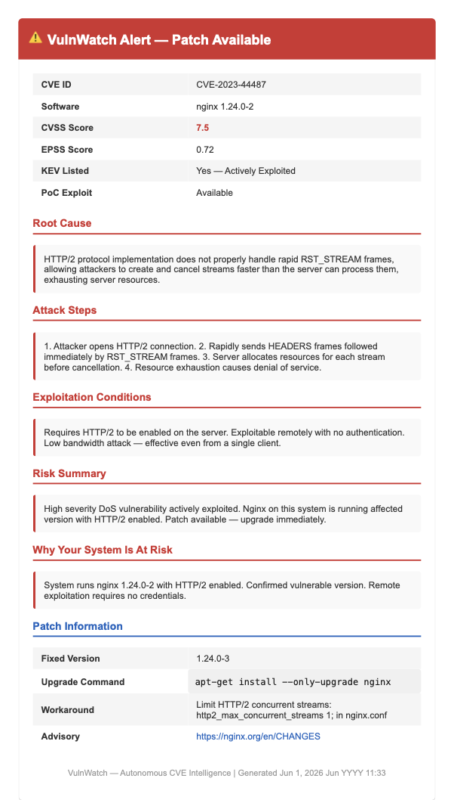
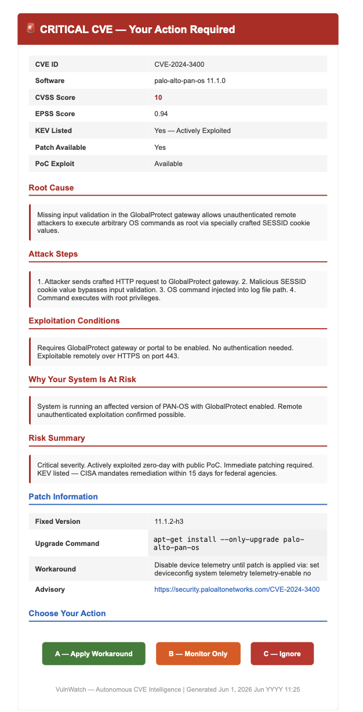

# VulnWatch — Autonomous CVE Intelligence & Vulnerability Monitoring System

> *Built with N8N · Claude AI · GitHub PoC Search · CISA KEV · Self-hosted on VPS*

---

## What Is VulnWatch?

**For a non-technical person:**
Every server connected to the internet has software running on it — a web server, a database, an email service. Hackers regularly discover weaknesses in this software and publish them publicly. These weaknesses are called **CVEs** (Common Vulnerabilities and Exposures). Most businesses find out about these vulnerabilities weeks or months too late — or never at all.

VulnWatch watches your server 24 hours a day, 7 days a week. Every night it scans what software is running, cross-checks against every known publicly disclosed vulnerability, and tells you: *"You have a critical weakness — here is exactly how an attacker would exploit it, and here is how to fix it."* No human involvement required until a decision is needed.

**For a technical person:**
VulnWatch is a fully autonomous, multi-agent vulnerability intelligence pipeline running on N8N. It performs nightly VPS scans via SSH, enriches findings with CVSS/EPSS/KEV/PoC data, and routes each CVE through a 5-agent LLM orchestration chain (Mistral → Claude Sonnet → Claude Haiku) that validates contextual exploitability, fetches patch data, and triggers HITL or auto-alert based on a composite risk scoring model. All data stays on the VPS — no external database services.

---

## The Problem This Solves

Commercial vulnerability scanners (Rapid7, Tenable, Qualys) cost **£3,000–£20,000 per year** and tell you this:

> *"CVE-2024-XXXX affects your system."*

That is not enough information to act on.

VulnWatch tells you this instead:

> *"CVE-2024-XXXX affects your Apache 2.4.51. The attack requires no authentication. A public proof-of-concept exploit exists on GitHub. Your configuration exposes the vulnerable endpoint on port 443. Here is the exact attack path. The patched version is 2.4.62 — here is the upgrade command."*

The reasoning layer — *"is this CVE actually exploitable on MY specific system?"* — does not exist in any current commercial product at this price point.

---

## Key Concepts Explained

### CVE — Common Vulnerability and Exposure
A CVE is a publicly registered security weakness found in software. Every CVE gets a unique ID (e.g. `CVE-2021-44228` for the famous Log4Shell vulnerability). Think of it as a global registry of known software flaws, maintained by MITRE and backed by the US government.

### NVD — National Vulnerability Database
The NVD (run by NIST, a US government agency) enriches each CVE with a **CVSS score** — a number from 0 to 10 that measures how severe the vulnerability is. A score of 9+ is Critical. VulnWatch pulls CVSS scores from NVD via the OSV API.

### EPSS — Exploit Prediction Scoring System
CVSS tells you how bad a vulnerability *could* be. EPSS tells you how likely it is to be *actually exploited in the real world right now*. A CVE with CVSS 9 but EPSS 0.001 is theoretically severe but rarely targeted. A CVE with CVSS 7 and EPSS 0.8 is being actively weaponised. VulnWatch uses both to prioritise what actually needs your attention.

### KEV — CISA Known Exploited Vulnerabilities Catalogue
CISA (the US Cybersecurity and Infrastructure Security Agency) maintains a live list of CVEs that are **confirmed to be actively exploited in real attacks right now**. If a CVE appears on the KEV list, it is not theoretical — someone is using it. VulnWatch checks every CVE against the KEV catalogue daily.

### PoC — Proof of Concept Exploit
A PoC is working attack code, usually published on GitHub, that demonstrates how to exploit a CVE. The existence of a public PoC dramatically raises the real-world risk — it lowers the skill barrier for attackers from "nation-state" to "anyone who can copy and paste." VulnWatch searches GitHub for PoCs on every high-severity CVE it finds.

### HITL — Human-in-the-Loop
For the most critical CVEs (no patch available + actively exploited), VulnWatch does not act automatically. It sends you an email with full context and three options: **Apply workaround**, **Monitor only**, or **Ignore**. Your response triggers the next action. This keeps a human in control of the highest-risk decisions.

---

## Why SSH? Where Does It Connect?

VulnWatch runs **inside N8N on a self-hosted VPS** (Virtual Private Server). To scan the software actually running on that server, it needs to execute shell commands on the host system — commands like:

```bash
dpkg -l           # lists every installed Debian package and version
nmap -sV -p-      # scans all open ports and detects service versions
docker ps         # lists running containers
python3 --version # checks runtime versions
```

N8N cannot run these commands directly against its own host. Instead, VulnWatch uses the **N8N SSH node** to connect back to the VPS host via a dedicated SSH key pair (`~/.ssh/n8n_vulnwatch`), execute the scan commands, and return the output — all over an encrypted SSH tunnel on the internal network.

**SSH is used here because:**
- It is the standard, secure, encrypted protocol for remote command execution on Linux servers
- The key-based authentication (no password) is stored in the N8N credentials vault — never in the workflow JSON
- It works reliably from inside Docker to the host VPS without exposing any ports to the internet

**Architecture**: N8N (Docker container) → SSH → VPS Host → returns installed packages and running services → N8N parses and routes to CVE analysis

---

## System Architecture

```
┌─────────────────────────────────────────────────────────┐
│                    NIGHTLY TRIGGER (00:00)                │
└─────────────────────┬───────────────────────────────────┘
                      │
                      ▼
┌─────────────────────────────────────────────────────────┐
│              WORKFLOW 1 — DAILY SCANNER                  │
│  SSH into VPS → scan packages, ports, containers         │
│  → POST results to CVE Analysis Pipeline webhook         │
└─────────────────────┬───────────────────────────────────┘
                      │
                      ▼
┌─────────────────────────────────────────────────────────┐
│           WORKFLOW 2 — CVE ANALYSIS PIPELINE             │
│                                                          │
│  OSV API → CVSS Score                                    │
│  EPSS API → Exploitation Probability                     │
│  CISA KEV → Active Exploitation Check                    │
│  GitHub API → PoC Exploit Search (rate-limited, looped)  │
│                                                          │
│  ┌──────────────────────────────────────────────────┐   │
│  │         5-AGENT ORCHESTRATION CHAIN              │   │
│  │  Mistral 7B    → Orchestrator (routing)          │   │
│  │  Claude Sonnet → Analysis Agent (severity)       │   │
│  │  Claude Sonnet → Validation Agent (exploitable?) │   │
│  │  Claude Haiku  → Patch Agent (fix commands)      │   │
│  │  Llama 3.1 70B → Bulk CVE Classification         │   │
│  └──────────────────────────────────────────────────┘   │
│                                                          │
│  → Store all results in PostgreSQL + pgvector (on VPS)   │
└──────┬──────────────────────────┬───────────────────────┘
       │                          │
       ▼                          ▼
┌─────────────┐          ┌─────────────────────┐
│ WORKFLOW 4  │          │    WORKFLOW 3        │
│ ALERT SYSTEM│          │   HITL HANDLER       │
│ Auto email  │          │ Critical + no patch  │
│ for CVSS>7  │          │ → Email Rinoy        │
│ + patch avail│         │ → Wait for decision  │
└─────────────┘          │ → Apply/Monitor/Ignore│
                         └─────────────────────┘
                                   │
┌─────────────────────────────────────────────────────────┐
│           WORKFLOW 5 — WEEKLY SUMMARY                    │
│  Every Sunday 9am → digest of low/medium CVEs            │
│  → Single summary email                                  │
└─────────────────────────────────────────────────────────┘
```

---

## Alert Logic

| Condition | Action |
|---|---|
| CVSS > 9 + No patch + KEV listed | HITL required — critical email sent immediately |
| CVSS > 9 + No patch | HITL required — waiting for human decision |
| CVSS > 7 + EPSS > 0.1 + patch available | Auto alert + full patch instructions |
| Not exploitable on this config | Stored silently — no noise |
| CVSS < 7 | Stored silently — included in Sunday digest only |

---

## Workflow Screenshots

### Workflow 1 — Daily VPS Scanner
Runs every night at midnight. SSHes into the VPS, scans all installed packages, open ports, and running containers.


---

### Workflow 2 — CVE Analysis Pipeline
The core intelligence engine. Receives scan results, enriches with CVSS/EPSS/KEV/PoC data, routes through 5 AI agents, stores results, and triggers alerts.


---

### Workflow 3 — HITL Handler
Handles the highest-risk CVEs where no patch exists. Emails Rinoy with full context and waits for a human decision.


**HITL Decision — Apply Workaround:**


**HITL Decision — Monitor Only:**


**HITL Decision — Ignore:**


---

### Workflow 4 — Alert System
Sends structured email alerts for auto-actionable vulnerabilities (patch available, CVSS > 7, EPSS > 0.1).


**Sample Alert Email:**



---

### Workflow 5 — Weekly Summary
Every Sunday at 9am, sends a digest of all low and medium severity CVEs from the past week — so low-priority noise never interrupts the week.


**Sample Weekly Summary Email:**


---

### HITL Interface Overview



---

## Agent Breakdown

| Agent | Model | What It Does |
|---|---|---|
| Orchestrator | Mistral 7B (OpenRouter) | Controls the full pipeline flow — routes between agents based on severity and data completeness |
| Analysis Agent | Claude Sonnet 4.6 | Reasons about CVE severity in context — is this CVE relevant to the specific software version installed? |
| Validation Agent | Claude Sonnet 4.6 | Confirms exploitability — are the exact conditions required for this CVE actually present on this system? |
| Patch Agent | Claude Haiku 4.5 | Extracts fixed version, generates the exact upgrade command, finds workarounds for unpatched CVEs |
| Classifier | Llama 3.1 70B (OpenRouter) | Bulk-classifies the initial CVE list before expensive API calls — routes only relevant CVEs forward |

**Why different models?** Cost and quality are matched to task complexity. Claude Sonnet handles deep reasoning. Claude Haiku handles structured extraction. Mistral and Llama handle fast routing at near-zero cost. A single Claude Sonnet call for everything would cost 10× more with no benefit on classification tasks.

---

## Data Sources

| Source | What It Provides | Cost |
|---|---|---|
| OSV (Google) | CVSS scores, affected version ranges, fixed versions | Free |
| EPSS (FIRST.org) | Real-world exploitation probability per CVE | Free |
| CISA KEV | Confirmed active exploitation in the wild | Free |
| GitHub Search API | Public PoC exploit code | Free (with token) |
| NVD (NIST) | CVE descriptions and metadata | Free |

**Total running cost: ~$9–12/month** (N8N VPS + LLM API calls via OpenRouter)

---

## Why This Is Relevant

### For the job market:
- Demonstrates **real production system** running on live infrastructure — not a demo
- Shows **multi-agent LLM orchestration** with genuine task routing justification
- Uses **MSc Cybersecurity knowledge** in a practical, deployed system
- Covers **RAG, HITL, multi-LLM routing, PostgreSQL + pgvector, SSH, API integration** in one project
- Addresses a **real gap** in affordable vulnerability intelligence tooling

### For real-world value:
- A solo developer or small team cannot afford Rapid7 or Tenable
- VulnWatch gives the same intelligence layer at 1% of the cost
- The contextual exploitability check is the feature that commercial tools at this price point do not have — it eliminates false alarm fatigue

---

## Tech Stack

| Tool | Role |
|---|---|
| N8N (self-hosted, Docker) | Workflow orchestration — all 5 workflows |
| PostgreSQL + pgvector | Local database on VPS — CVE records + vector embeddings |
| Claude Sonnet 4.6 | Deep exploit reasoning + exploitability validation |
| Claude Haiku 4.5 | Patch information extraction |
| Mistral 7B (OpenRouter) | Orchestration routing |
| Llama 3.1 70B (OpenRouter) | Bulk CVE classification |
| OSV API | CVSS scores + fixed versions |
| EPSS API (FIRST.org) | Exploitation probability |
| CISA KEV | Active exploitation confirmation |
| GitHub Search API | PoC exploit search |
| SSH (N8N SSH node) | VPS scanning — connects back to host via ed25519 key |
| Email (SMTP) | Alerts + HITL interface |

---

## Project Structure

```
VulnWatch/
├── workflows/
│   ├── VulnWatch — Daily Scanner.json         # Workflow 1
│   ├── VulnWatch — CVE Analysis Pipeline.json  # Workflow 2
│   ├── VulnWatch - HITL Handler.json           # Workflow 3
│   ├── VulnWatch - Alert System.json           # Workflow 4
│   └── VulnWatch — Weekly Summary.json         # Workflow 5
├── docs/
│   ├── architecture.md                         # Full architecture detail
│   ├── n8n_node_guide.md                       # Step-by-step N8N build guide
│   ├── database_setup.md                       # PostgreSQL schema + setup
│   ├── api_reference.md                        # All external API endpoints
│   ├── agent_prompts.md                        # LLM prompts for each agent
│   └── test_cases.md                           # Test scenarios
├── images/                                     # Workflow screenshots + alert samples
└── README.md
```

---

## What This System Does NOT Do

- Does **not** apply patches automatically — all fixes are human-executed
- Does **not** modify firewall rules or system configuration
- Does **not** run exploit code
- Does **not** scan systems outside the VPS it runs on
- Pure intelligence and guidance tool — every action stays with the human

---

## Built By

**Rinoy Francis** — AI Automation Engineer  
[LinkedIn](https://www.linkedin.com/in/rinoyfrancis/) · [GitHub](https://github.com/rinoyfrancis2)
